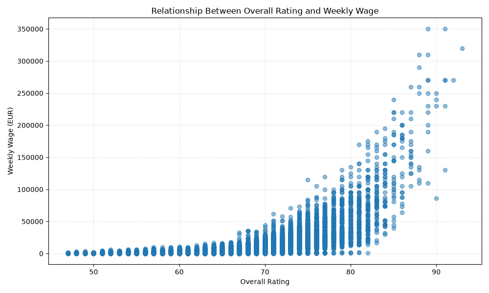
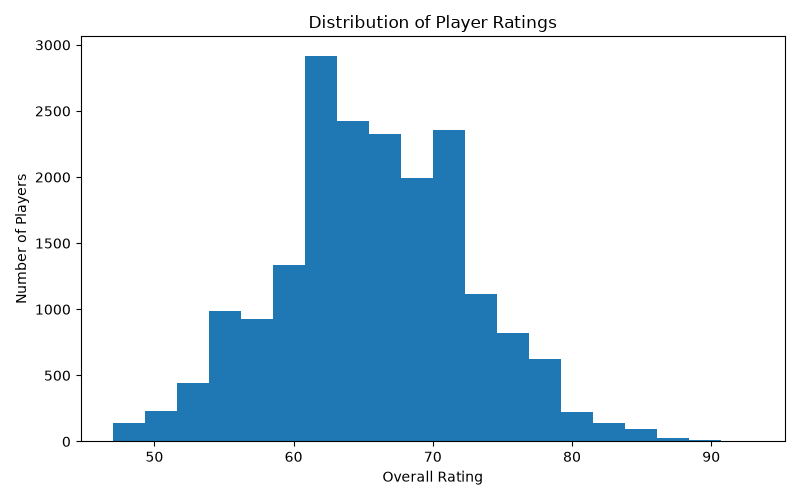
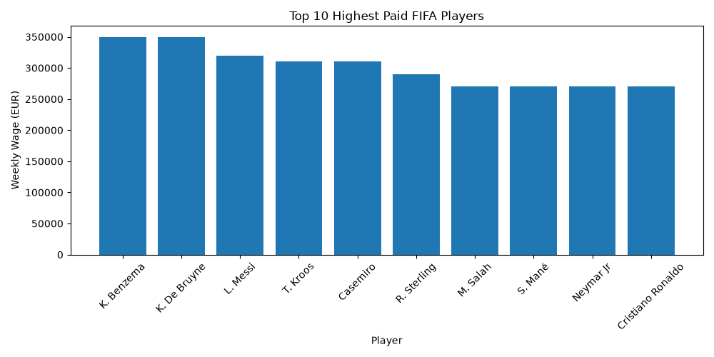
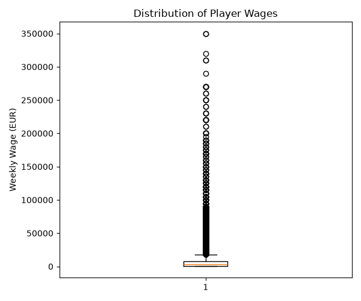
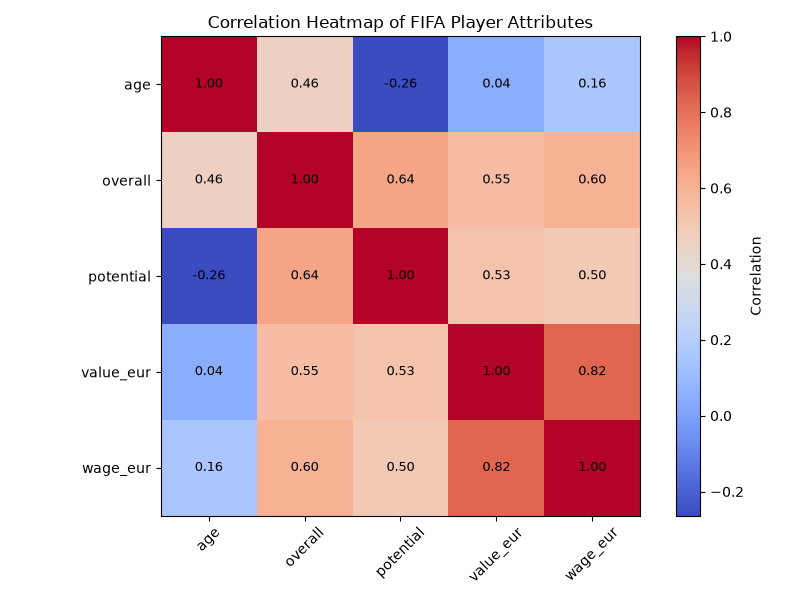

# FIFA Wage vs Rating Analysis
Analysis of the correlation between FIFA players wages and overall rating using Python

## Tools used: 
Python, Pandas & Matplotlib

## What was done:
Loaded FIFA 22 player data from a csv file then cleaned and selecged the relevant columns. 
Created a scatter plot to illustrate the correlation between the players overall and their wage.
Finished off by saving the vizualization as an image. 

## Result:
The analysis shows a very clear positive relationship as players with higher overalls generally earn higher wages.

## Visualizations

### 1. Player Rating vs Weekly Wage

This scatter plot explores the relationship between a player's overall rating and their weekly wage. While higher-rated player generally earn higher wages, the graph also highlights several high-paid outliers.

---

### 2. Distribution of Player Ratings

This histogram shows the distribution of FIFA player ratings. Most professional players fall between an overall rating of 60 and 75, while elite players above 85 are comparatively rare.

---

### 3. Top 10 Highest Paid FIFA Players

This bar chart compares the weekly wages of the ten highest-paid players in the dataset. It demonstrates the significant salary gap between football's highest earners and the rest of the player population.

---

### 4. Distribution of Weekly Wages

The box plot summarizes the spread of player wages and highlights numerous outliers. This indicates that wage distribution is highly skewed, with a relatively small number of players earning exceptionally high salaries.

---

### 5. Correlation Heatmap

The correlation heatmap illustrates the relationships between key numerical player attributes such as age, overall rating, potential, market value, and weekly wage. Strong positive correlations indicate that players with higher ratings generally have greater market values and receive higher wages.

## Author
First year data science student exploring sport analytics.

